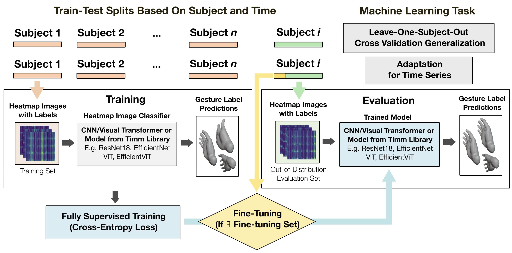

<div align="center">
  
  
  # Benchmarking Out-of-Distribution Generalization and Adaptation for Electromyography
  ### Under Review at NeurIPS 2024
</div>

<div align="center">
  
</div> 

<p align="left">
<!--     <a href='http://arxiv.org/abs/2311.01455'>
      
    </a> -->
    <a href='https://emgbench.github.io/'>
      
    </a>
</p>

This is the official repo for the paper:  

**[Benchmarking Out-of-Distribution Generalization and Adaptation for Electromyography](https://emgbench.github.io/)**  
[Jehan Yang*](https://jehanyang.github.io/about/), [Maxwell Soh*](), [Vivianna Lieu](), [Douglas J. Weber](https://www.meche.engineering.cmu.edu/directory/bios/weber-douglas.html), [Zackory Erickson](https://zackory.com/)

## Table of Contents
- [Usage](#usage)
  - [Installation and Setup](#installation-and-setup)
  - [Benchmarking Datasets](#benchmarking-datasets)
  - [Replicating Tables](#replicating-tables)
- [Customization](#customization)
  - [Adding Datasets](#adding-datasets)
- [Troubleshooting](#troubleshooting)
- [Development](#development)

# Usage

## Installation and Setup
Install a version of Miniforge distribution `>= Miniforge3-22.3.1-0`, which will give you access to `mamba`. This is a faster and more verbose version of `conda`. 

It is recommended to run on a Linux x86_64 (amd64) architecture. The following instructions are tested on an Ubuntu distro. 

Install the necessary packages:
```console
$ sudo apt update
$ sudo apt install git jq git-lfs
$ git lfs install
```

Create and activate the virtual environment:
```console
$ git clone https://github.com/maxwellsoh/emgBenchmarking.git
$ cd emgBenchmarking/
$ mamba env create -n emgbench -f environment.yml
$ conda activate emgbench
```

## Benchmarking Datasets
CNN_EMG.py will automatically download the necessary datasets for each run. Note that the Hyser dataset can take hours to download. 

## Replicating Tables
To replicate the first table, run the following shell script for each of the 6 datasets (capgmyo, hyser, m-dataset, ninapro-db5, uciemg, jehan). The parameters that will need to be changed across runs are at the top
```
starting_index=1
ending_index=10 # set to the maximum number of participants for the dataset
current_dataset=capgmyo # set to the dataset you want to run with
number_windows=50 # set to 1/20 of sampling rate or 1/16 of sampling rate for Hyser

for subj in $(seq $starting_index $ending_index)
do
    python CNN_EMG.py --dataset=$current_dataset --seed=0 --model=resnet18 --epochs=100 --project_name_suffix=__preprocessing-comparison --turn_off_scaler_normalization=True --leftout_subject=$subj --leave_one_subject_out=True --transfer_learning=True --train_test_split_for_time_series=True --save_images=True --learning_rate=5e-4 --proportion_transfer_learning=0.2 --proportion_data_from_training_subjects=1.0 --finetuning_epochs=750 --pretrain_and_finetune=True --partial_dataset_ninapro=True;
    python CNN_EMG.py --dataset=$current_dataset --seed=0 --model=resnet18 --epochs=100 --project_name_suffix=__preprocessing-comparison --turn_off_scaler_normalization=True --leftout_subject=$subj --leave_one_subject_out=True --transfer_learning=True --train_test_split_for_time_series=True --save_images=True --learning_rate=5e-4 --proportion_transfer_learning=0.2 --proportion_data_from_training_subjects=1.0 --turn_on_rms=True --rms_input_windowsize=$number_windows --finetuning_epochs=750 --pretrain_and_finetune=True --partial_dataset_ninapro=True;
    python CNN_EMG.py --dataset=$current_dataset --seed=0 --model=resnet18 --epochs=100 --project_name_suffix=__preprocessing-comparison --turn_off_scaler_normalization=True --leftout_subject=$subj --leave_one_subject_out=True --transfer_learning=True --train_test_split_for_time_series=True --save_images=True --learning_rate=5e-4 --proportion_transfer_learning=0.2 --proportion_data_from_training_subjects=1.0 --turn_on_spectrogram=True --finetuning_epochs=750 --pretrain_and_finetune=True --partial_dataset_ninapro=True;
    python CNN_EMG.py --dataset=$current_dataset --seed=0 --model=resnet18 --epochs=100 --project_name_suffix=__preprocessing-comparison --turn_off_scaler_normalization=True --leftout_subject=$subj --leave_one_subject_out=True --transfer_learning=True --train_test_split_for_time_series=True --save_images=True --learning_rate=5e-4 --proportion_transfer_learning=0.2 --proportion_data_from_training_subjects=1.0 --turn_on_cwt=True --finetuning_epochs=750 --pretrain_and_finetune=True --partial_dataset_ninapro=True;
    wait
done
```

To replicate the second table, run the following shell script for each of the 6 datasets:
```
starting_index=1
ending_index=10 # set to the maximum number of participants for the dataset
current_dataset=capgmyo # set to the dataset you want to run with
preprocessing="--turn_on_cwt=True" # set to "" for raw, "--turn_on_cwt=True" for cwt, or "--turn_on_spectrogram=True" for stft depending on which preprocessing method was the best for the dataset


for subj in $(seq $starting_index $ending_index)
do
    python CNN_EMG.py --dataset=$current_dataset $preprocessing --seed=0 --model=resnet18 --epochs=50 --project_name_suffix=__model-comparison_one-session --turn_off_scaler_normalization=True --leftout_subject=$subj --leave_one_subject_out=True --transfer_learning=True --train_test_split_for_time_series=True --save_images=True --learning_rate=5e-4 --proportion_transfer_learning=0.2 --proportion_data_from_training_subjects=1.0 --finetuning_epochs=375 --pretrain_and_finetune=True --partial_dataset_ninapro=True;
    python CNN_EMG.py --dataset=$current_dataset $preprocessing --seed=0 --model=vit_tiny_patch16_224 --epochs=50 --project_name_suffix=__model-comparison_one-session --turn_off_scaler_normalization=True --leftout_subject=$subj --leave_one_subject_out=True --transfer_learning=True --train_test_split_for_time_series=True --save_images=True --learning_rate=5e-4 --proportion_transfer_learning=0.2 --proportion_data_from_training_subjects=1.0 --finetuning_epochs=375 --pretrain_and_finetune=True --partial_dataset_ninapro=True;
    python CNN_EMG.py --dataset=$current_dataset $preprocessing --seed=0 --model=efficientnet_b0 --epochs=50 --project_name_suffix=__model-comparison_one-session --turn_off_scaler_normalization=True --leftout_subject=$subj --leave_one_subject_out=True --transfer_learning=True --train_test_split_for_time_series=True --save_images=True --learning_rate=5e-4 --proportion_transfer_learning=0.2 --proportion_data_from_training_subjects=1.0 --finetuning_epochs=375 --pretrain_and_finetune=True --partial_dataset_ninapro=True;
    python CNN_EMG.py --dataset=$current_dataset $preprocessing --seed=0 --model=efficientvit_b0 --epochs=50 --project_name_suffix=__model-comparison_one-session --turn_off_scaler_normalization=True --leftout_subject=$subj --leave_one_subject_out=True --transfer_learning=True --train_test_split_for_time_series=True --save_images=True --learning_rate=5e-4 --proportion_transfer_learning=0.2 --proportion_data_from_training_subjects=1.0 --finetuning_epochs=375 --pretrain_and_finetune=True --partial_dataset_ninapro=True;

    wait
done
```

To replicate the proportions for the third table, run the following shell script for each of the 6 datasets:
```
starting_index=1
ending_index=10 # set to the maximum number of participants for the dataset
current_dataset=capgmyo # set to the dataset you want to run with
preprocessing="--turn_on_cwt=True" # set to "" for raw, "--turn_on_cwt=True" for cwt, or "--turn_on_spectrogram=True" for stft depending on which preprocessing method was the best for the dataset
best_model=resnet18 # set to the model that performed best for the dataset

for subj in $(seq $starting_index $ending_index)
do
    python CNN_EMG.py --dataset=$current_dataset --seed=0 --model=$best_model $preprocessing --epochs=50 --project_name_suffix=__proportion-comparison --turn_off_scaler_normalization=True --leftout_subject=$subj --leave_one_subject_out=True --transfer_learning=True --train_test_split_for_time_series=True --save_images=True --learning_rate=5e-4 --proportion_transfer_learning=0.2 --proportion_data_from_training_subjects=1.0 --finetuning_epochs=375 --pretrain_and_finetune=True --partial_dataset_ninapro=True;
    python CNN_EMG.py --dataset=$current_dataset --seed=0 --model=$best_model $preprocessing --epochs=50 --project_name_suffix=__proportion-comparison --turn_off_scaler_normalization=True --leftout_subject=$subj --leave_one_subject_out=True --transfer_learning=True --train_test_split_for_time_series=True --save_images=True --learning_rate=5e-4 --proportion_transfer_learning=0.4 --proportion_data_from_training_subjects=1.0 --finetuning_epochs=375 --pretrain_and_finetune=True --partial_dataset_ninapro=True;
    python CNN_EMG.py --dataset=$current_dataset --seed=0 --model=$best_model $preprocessing --epochs=50 --project_name_suffix=__proportion-comparison --turn_off_scaler_normalization=True --leftout_subject=$subj --leave_one_subject_out=True --transfer_learning=True --train_test_split_for_time_series=True --save_images=True --learning_rate=5e-4 --proportion_transfer_learning=0.6 --proportion_data_from_training_subjects=1.0 --finetuning_epochs=375 --pretrain_and_finetune=True --partial_dataset_ninapro=True;
    python CNN_EMG.py --dataset=$current_dataset --seed=0 --model=$best_model $preprocessing --epochs=50 --project_name_suffix=__proportion-comparison --turn_off_scaler_normalization=True --leftout_subject=$subj --leave_one_subject_out=True --transfer_learning=True --train_test_split_for_time_series=True --save_images=True --learning_rate=5e-4 --proportion_transfer_learning=0.8 --proportion_data_from_training_subjects=1.0 --finetuning_epochs=375 --pretrain_and_finetune=True --partial_dataset_ninapro=True;

    wait
done
```

For those datasets with multiple sessions, run the following shell script for these datasets:
```
starting_index=1
ending_index=10 # set to the maximum number of participants for the dataset
current_dataset=capgmyo # set to the dataset you want to run with
preprocessing="--turn_on_cwt=True" # set to "" for raw, "--turn_on_cwt=True" for cwt, or "--turn_on_spectrogram=True" for stft depending on which preprocessing method was the best for the dataset
best_model=resnet18 # set to the model that performed best for the dataset

for subj in $(seq $starting_index $ending_index)
do
    python CNN_EMG.py --dataset=$current_dataset --seed=0 --model=$best_model $preprocessing --epochs=50 --project_name_suffix=__intersession-comparison --turn_off_scaler_normalization=True --leftout_subject=$subj --leave_one_subject_out=True --leave_one_session_out=True --train_test_split_for_time_series=True --save_images=True --learning_rate=5e-4 --proportion_data_from_training_subjects=1.0 --finetuning_epochs=375 --pretrain_and_finetune=True --partial_dataset_ninapro=True --proportion_transfer_learning_from_leftout_subject=0.25;
    wait
done
```

# Customization
## Adding Datasets
New datasets can be benchmarked with `CNN_EMG.py` after being processed into HDF5 files by saving them to the following directory: `DatasetsProcessed_hdf5/[DATASET-NAME]/p[N]/participant_[N].hdf5` where `N` is the participant's number ranging from 1 to the number of subjects. The keys of each HDF5 file should be the the names of each gesture and the data for each gesture should be stored with shape `[# TRIALS, # ELECTRODES, # TIMESTEPS]`. Also, create a file `DatasetsProcessed_hdf5/[DATASET-NAME]/frequency.txt` just containing the frequency of the dataset in Hz. 

To run the new dataset, input the dataset name to the dataset argument of `CNN_EMG.py`. Every subject must have data for all of the gestures in order for the dataset to be processed by `utils_generic.py`.

# Troubleshooting
If you run into an error, `OSError: [Errno 24] Too many open files`
Run the command 
```console
$ ulimit -n 65536
```

# Development

To update the virtual environment, run
```console
$ mamba env update --file environment.yml --prune
$ pip install -r requirements.txt
```

FOR DEVELOPMENT: To save the virtual environment, run
```console
$ mamba env export --no-builds > environment.yml
$ pip list --format=freeze > requirements.txt
```
